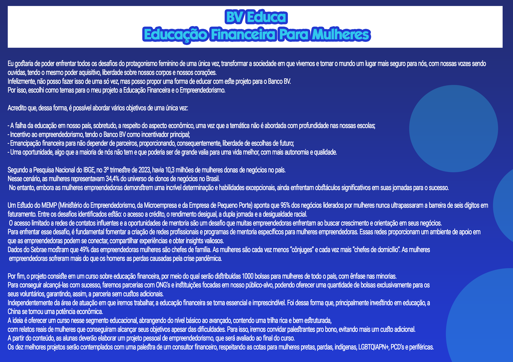
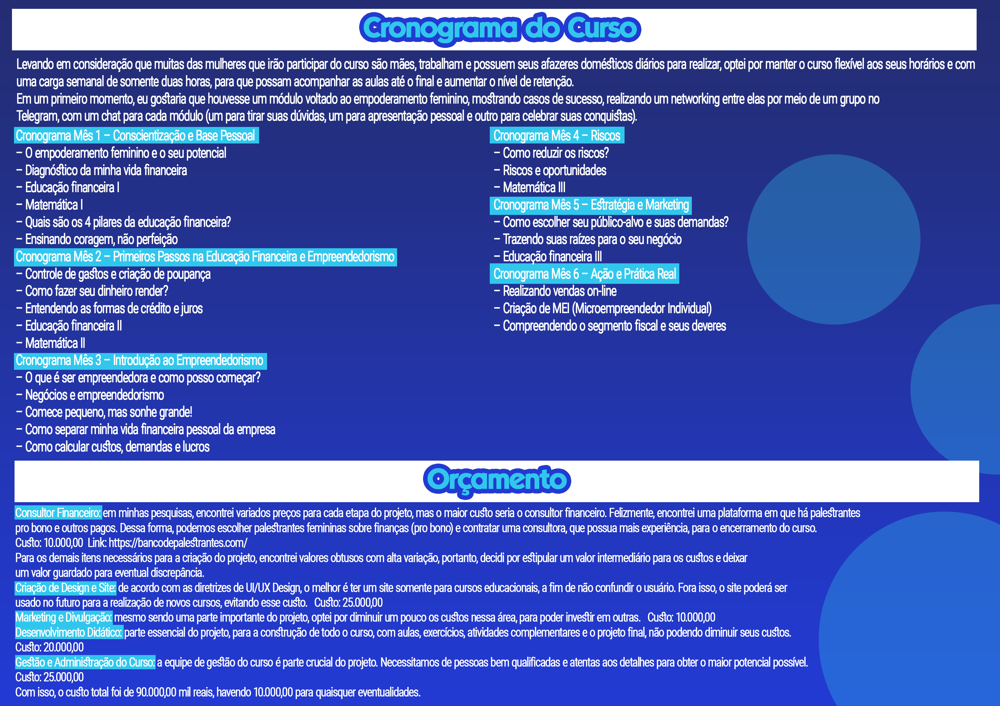
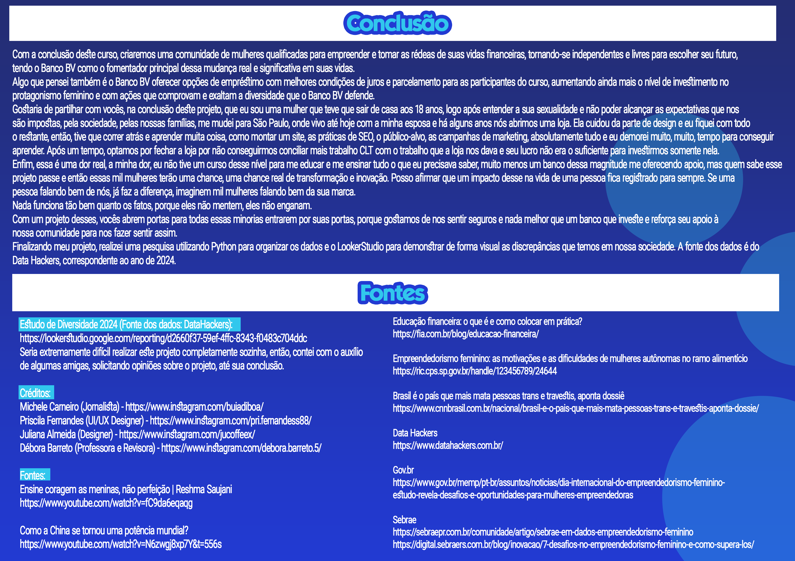

# 🏦 BV Educa: Educação Financeira e Empreendedorismo para Mulheres

## 📌 Sobre o Projeto
Este projeto foi desenvolvido como uma proposta estratégica para o **Banco BV**, focada no protagonismo feminino. O objetivo é utilizar a educação financeira e o incentivo ao empreendedorismo como ferramentas de emancipação e transformação social.

> "Transformar a sociedade em que vivemos e tornar o mundo um lugar mais seguro para nós, com nossas vozes sendo ouvidas e tendo liberdade sobre nossos corpos e corações."

---

## 📊 O Problema e a Oportunidade
Através de uma análise baseada em dados do IBGE (2023) e Data Hackers, identifiquei:
* **Representatividade:** Mulheres representam 34,4% dos donos de negócios no Brasil (10,3 milhões).
* **Gap de Conhecimento:** A falha na educação econômica básica nas escolas brasileiras.
* **Necessidade:** A urgência de emancipação financeira para autonomia de escolha e qualidade de vida.

  
  

---

## 💡 A Solução Proposta
O **BV Educa** foca em quatro pilares principais:
1. **Educação Econômica:** Suprir a lacuna do ensino tradicional.
2. **Incentivo ao Empreendedorismo:** O Banco BV como principal facilitador.
3. **Emancipação:** Liberdade financeira para que mulheres não dependam de terceiros.
4. **Oportunidade:** Democratização do acesso a ferramentas de gestão.

---

## 🛠️ Stack Técnica e Processo Analítico

Para este projeto, não apenas idealizei a proposta, mas realizei o ciclo completo de análise de dados:

* **Extração e Limpeza:** Realizei o tratamento de bases de dados do **IBGE (2023)** e **Data Hackers (2024)**, focando na padronização de variáveis de gênero, renda e escolaridade.
* **Análise Exploratória (EDA):** Investigação de correlações entre a falta de educação financeira básica e o índice de falência de pequenos negócios liderados por mulheres.
* **Visualização de Dados:** Desenvolvi dashboards no **Looker Studio** para monitorar KPIs de impacto social e potencial de mercado, transformando números em narrativas visuais estratégicas.
* **Insights Orientados a Dados:** A solução proposta (BV Educa) não é baseada em suposições, mas na lacuna identificada de que 34,4% das donas de negócios no Brasil operam com baixo suporte em gestão financeira.

---

## 📂 Documentação Completa
Para detalhes sobre a fundamentação teórica, referências bibliográficas e o plano de ação detalhado:

* 📄 [**Acessar Relatório Completo (PDF)**](./Estudo-de-Caso-BV-Educa-Sthefany-Ferreira.pdf)

> **Nota:** Os gráficos apresentados nos slides acima são reflexos diretos do dashboard construído no Looker Studio e Photoshop.
